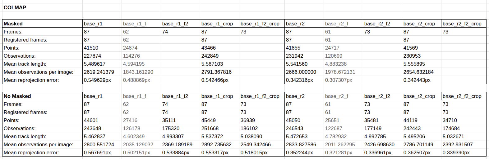
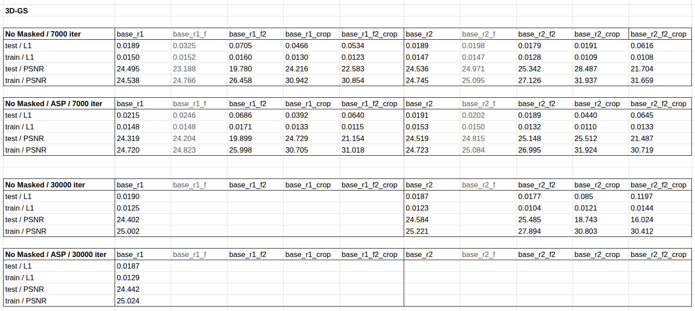
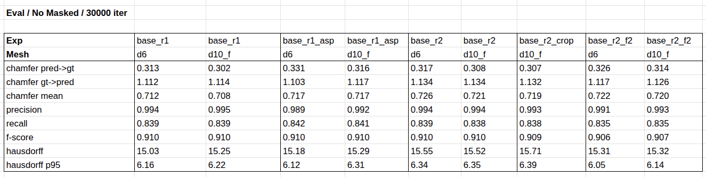

# High-Fidelity 3D Mesh Reconstruction with Gaussian Splatting

---

## 1. Method Selection and Justification

### 1.1 Initial Survey

A literature review of recent Gaussian-Splatting-based (GS) surface-reconstruction methods from 2025–2026 was conducted. Two candidate methods were considered in detail:

**GLINT (CVPR 2026 Oral)** — *Modeling Scene-Scale Transparency via Gaussian Radiance Transport*. GLINT currently reports state-of-the-art geometry metrics, especially on scenes containing transparent or highly reflective surfaces. However, GLINT relies on a G-buffer prior produced by DiffusionRenderer (a video-diffusion-based neural inverse-rendering model) and uses a 2D Gaussian ray tracer. In practice, the pipeline has two significant drawbacks for this task:

- **VRAM footprint.** Running DiffusionRenderer at full image resolution exceeds the available more than 16 GB of GPU memory. Lowering the input resolution to fit memory produced visibly blurry normal maps and lost the fine geometric details of the object, defeating the purpose of using a high-fidelity method.
- **Alternative priors did not help.** TransNormal was tried as a replacement normal estimator, but the normals were softer than those produced by DiffusionRenderer at low resolution. Lotus-2 could not be loaded at all due to model-weight size exceeding VRAM.
- According to the original paper, training GLINT *without* a strong G-buffer prior brings its accuracy down to the level of conventional 3DGS-surface methods, removing its main advantage.

([DiffusionRenderer and TransNormal examples](Examples.md))

**PGSR (TVCG 2024)** — *Planar-based Gaussian Splatting for Efficient and High-Fidelity Surface Reconstruction*. PGSR compresses each 3D Gaussian into a flat planar primitive and renders an unbiased depth as the ratio of the camera-to-plane distance and the splatted normal, then applies single-view and multi-view geometric consistency losses. The authors of recent surveys consistently rank PGSR as the strongest fully-image-driven GS surface method, and report the lowest mean Chamfer distance on the DTU benchmark among non-NeRF methods. Critically for this task, **PGSR does not require any pre-computed depth or normal prior** — it is trained from RGB images plus a COLMAP sparse point cloud only.

### 1.2 Final Choice: PGSR

PGSR was selected for the following reasons:

1. The target object is opaque and largely diffuse — it does not contain the transparent or specular surfaces where GLINT's advantage is decisive. Outside of that regime, PGSR is the second-best published method on standard benchmarks.
2. It needs no external priors, which removes the VRAM bottleneck that blocked GLINT.

---

## 2. Data Preparation — COLMAP

PGSR requires COLMAP camera poses and a sparse point cloud. Several preprocessing variants were tried to find the best Structure-from-Motion (SfM) input:

| Variant | Description |
|---|---|
| `base_r1` | Full resolution, all 87 frames |
| `base_r2` | Downscale ×2 on each axis |
| `base_r1_f`, `base_r2_f` | Aggressive filtering by sharpness (Laplacian variance) and mean brightness |
| `base_r1_f2`, `base_r2_f2` | Less aggressive filtering by sharpness and brightness |
| `base_r1_crop`, `base_r2_crop` | Crop by a fixed bounding box |
| `base_r1_f2_crop`, `base_r2_f2_crop` | Combination of mild filtering and cropping |

Both *masked* (foreground only) and *unmasked* variants were tested. Object masks were generated with **SAM3** and **RMBG-2.0**.

### Key COLMAP findings

- **Full resolution + no filtering (`base_r1`)** registered all 87 frames with 44 601 points and a mean reprojection error of 0.57 px.
- **Aggressive filtering (`base_r1_f`)** discarded too many frames (only 62 / 87 registered) and reduced the point cloud by ~38 %, indicating that the filter was rejecting frames that were actually useful for SfM.
- **Downscaling (`base_r2`)** produced a slightly lower reprojection error (0.35 px vs 0.57 px), but this is largely an artifact of the smaller pixel grid — the underlying geometric quality is similar to `base_r1`.
- **Cropping** (`*_crop`) slightly increased the point count and observations per image, suggesting the crop concentrates feature matching on the object of interest.
- **Masked vs unmasked** SfM produced very similar statistics; the unmasked version had slightly more points overall because the background also contributed features.

The best COLMAP configurations (those that registered all frames with good point coverage) were carried forward into training: `base_r1`, `base_r2`, `base_r2_f2`, `base_r2_crop`, and a few variants thereof.

---

## 3. Training

The selected COLMAP outputs were used to train PGSR at 7 000 and 30 000 iterations, with and without the `max_abs_split_points = 0` (ASP) variant of densification. The full PSNR / L1 numbers are reported in the supporting CSV; the most informative subset is summarized below.

### Selected results (No-Masked, 30 000 iterations)

| Experiment | test L1 ↓ | train L1 ↓ | test PSNR ↑ | train PSNR ↑ |
|---|---|---|---|---|
| `base_r1` | 0.0190 | 0.0125 | 24.40 | 25.00 |
| `base_r1` + ASP | 0.0187 | 0.0129 | 24.44 | 25.02 |
| `base_r2` | 0.0187 | 0.0123 | 24.58 | 25.22 |
| `base_r2_f2` | **0.0177** | 0.0104 | **25.49** | 27.89 |
| `base_r2_crop` | 0.0850 | 0.0121 | 18.74 | 30.80 |
| `base_r2_f2_crop` | 0.1197 | 0.0144 | 16.02 | 30.41 |

### Observations

- The `_crop` variants exhibit a large train/test gap (train PSNR ≈ 31 but test PSNR drops to 16–19). This is a classic distribution-shift symptom: the fixed-bbox crop changes the field of view between training and test cameras, so held-out views fall partially outside the trained volume.
- `base_r2_f2` reaches the highest test PSNR (25.49) — the milder filter removes the worst frames without overly thinning the dataset.
- `base_r1` and `base_r2` give nearly identical PSNR; the ASP variant changes PSNR only marginally.

Each training run took ≈ 3 hours, which capped the number of configurations that could be evaluated within the time budget for this task.

---

## 4. Mesh Extraction and Evaluation

### 4.1 Mesh extraction

Meshes were produced via PGSR's TSDF-fusion pipeline (`render.py`). Two critical parameters were explored:

- **`max_depth`** — depth-truncation cutoff for TSDF integration. Larger values fuse more of the volume into the mesh; smaller values produce a tighter, less noisy mesh.
- **`use_depth_filter`** — drops grazing-angle depth pixels before TSDF integration.

Due to a 32 GB RAM limit, the voxel size could not be reduced below 0.02 m. Two configurations were used:

- **`d6`** — `max_depth = 6`, depth filter disabled. Fewer holes near object edges, but a sparser mesh.
- **`d10_f`** — `max_depth = 10`, depth filter enabled. Denser mesh, but slightly more loss at edges.

### 4.2 Evaluation protocol

Each reconstructed mesh was rigidly aligned to the ground-truth scanner mesh in **CloudCompare**. The following geometry metrics were then computed (lower is better for distances, higher for ratios):

- **Chamfer distance** — bidirectional point-to-point distance. Reported as three numbers: `pred → gt` (precision-like), `gt → pred` (recall-like), and their **mean**.
- **Precision** — fraction of predicted points within a threshold of the GT surface.
- **Recall** — fraction of GT points within a threshold of the predicted surface.
- **F-score** — harmonic mean of precision and recall.
- **Hausdorff distance** and **Hausdorff p95** — worst-case and 95th-percentile distance, sensitive to outliers and holes.

### 4.3 Results

(units of distance metrics follow the scale of the aligned GT mesh; relative ordering is what matters)

[Mesh Example Images](Meshes.md)

---

## 5. Discussion

**Best configuration.** `base_r1 + d10_f` produced the best overall geometry: lowest mean Chamfer distance (0.708), highest precision (0.995), and the joint-best F-score (0.910). `base_r1 + d6` is essentially tied and has a marginally lower Hausdorff distance.

**Spread across configurations is small.** Mean Chamfer distance ranges from 0.708 to 0.726 — a spread of only 0.018. F-score varies between 0.906 and 0.910. This indicates that, beyond a baseline of "all frames registered, full resolution," the method is robust to preprocessing choices: filtering and cropping move the metrics by less than the noise floor of the evaluation itself.

**Precision ≫ Recall (the most important observation).** Mean precision is 0.993 but recall is 0.838, and `CD g→p` is consistently ≈ 3.6 × larger than `CD p→g` (1.12 vs 0.32). This asymmetry means **the predicted mesh is accurate where it exists, but is missing parts of the ground-truth surface**. 

**`d10_f` vs `d6`.** Enabling `use_depth_filter` with `max_depth = 10` slightly improves the mean Chamfer in 3 of 4 paired comparisons. The denser fusion captures more of the object, while the depth filter discards grazing-angle pixels that would otherwise pull the surface outward.

**ASP densification.** Disabling the abs-grad split cap (`max_abs_split_points = 0`) gives a small recall gain (+0.003) at the cost of a small precision loss (−0.005). More Gaussians fill more of the volume but with slightly noisier placement. Net effect on the mean Chamfer is essentially zero.

**Rendering quality does not predict geometry quality.** `base_r2_f2` had the best test PSNR (25.49) but its mesh ranked **8th out of 9** on mean Chamfer. The `_crop` variants reached train PSNR ≈ 31 but their geometry is comparable to other configurations. This is consistent with the task brief — rendering fidelity is a poor proxy for surface accuracy.

---

## 6. Conclusion

PGSR was chosen over the more recent GLINT because GLINT's reliance on a DiffusionRenderer G-buffer prior could not be satisfied within the 16 GB VRAM budget, while PGSR runs directly from RGB images and a COLMAP point cloud. Across nine mesh configurations spanning three COLMAP preprocessings, two densification regimes, and two TSDF settings, **`base_r1` (full resolution, no filtering, no crop) combined with `max_depth = 10` and `use_depth_filter` produced the best mesh** (mean Chamfer 0.708, precision 0.995, F-score 0.910).

The dominant error mode is incomplete coverage of the ground-truth surface rather than positional inaccuracy, the predicted mesh sits close to the true surface where it is reconstructed, but misses portions of it. The most promising directions to push this further are therefore:

1. **Finer TSDF voxel size** (currently 0.02 m, limited by RAM) to reduce surface holes.
2. **Better camera coverage of under-sampled regions** of the object (Current dataset has only 87 images).
3. **Switching to GLINT** on hardware with ≥ 24 GB VRAM, where the G-buffer prior can run at full resolution.

---

## References

- PGSR — https://github.com/zju3dv/PGSR
- GLINT — https://github.com/youngju-na/GLINT
- DiffusionRenderer — https://github.com/nv-tlabs/diffusion-renderer
- TransNormal — https://github.com/longxiang-ai/TransNormal
- Lotus-2 — https://github.com/EnVision-Research/Lotus-2
